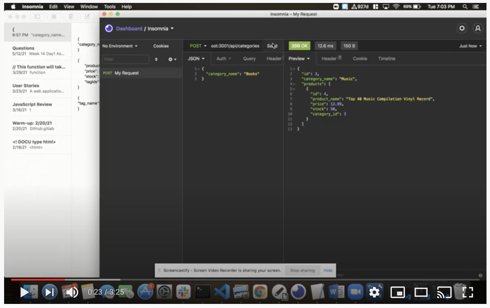

# E-commerce Back End 

## Description
Internet retail, also known as **e-commerce**, is the largest sector of the electronics industry, generating an estimated $29 trillion in 2019. E-commerce platforms like Shopify and WooCommerce provide a suite of services to businesses of all sizes. Due to their prevalence, understanding the fundamental architecture of these platforms is beneficial to software developers.

E-commerce Back End is an application that interacts with a MySQL database and an Express.js API. The database stores product catagories, products, and tags. Using the Express.js API, a user can retrieve all catagories, products, and tags or individual catagories, products, and tags using id's. Additionally, a user can create, update, and delete catagories, products, and tags.
        
## Installation     
To install this application type `npm i` in the command line to install the required dependencies. Then use `node server.js` to start the application

## Technologies Used

```
Node.js
Inquirer
MySQL
Sequelize
```

## User Story

```md
AS A manager at an internet retail company
I WANT a back end for my e-commerce website that uses the latest technologies
SO THAT my company can compete with other e-commerce companies
```

## Acceptance Criteria

```md
GIVEN a functional Express.js API
WHEN I add my database name, MySQL username, and MySQL password to an environment variable file
THEN I am able to connect to a database using Sequelize
WHEN I enter schema and seed commands
THEN a development database is created and is seeded with test data
WHEN I enter the command to invoke the application
THEN my server is started and the Sequelize models are synced to the MySQL database
WHEN I open API GET routes in Insomnia Core for categories, products, or tags
THEN the data for each of these routes is displayed in a formatted JSON
WHEN I test API POST, PUT, and DELETE routes in Insomnia Core
THEN I am able to successfully create, update, and delete data in my database
```

## Demo 

[](https://www.youtube.com/watch?v=M6AKm0puccQ)

## Questions       
If you have any questions please contact me by email.

* Email: ashquinngordon@gmail.com
        
## License      
Licensed under the MIT license. Use the following link for permissions and allowances:
https://opensource.org/licenses/MIT